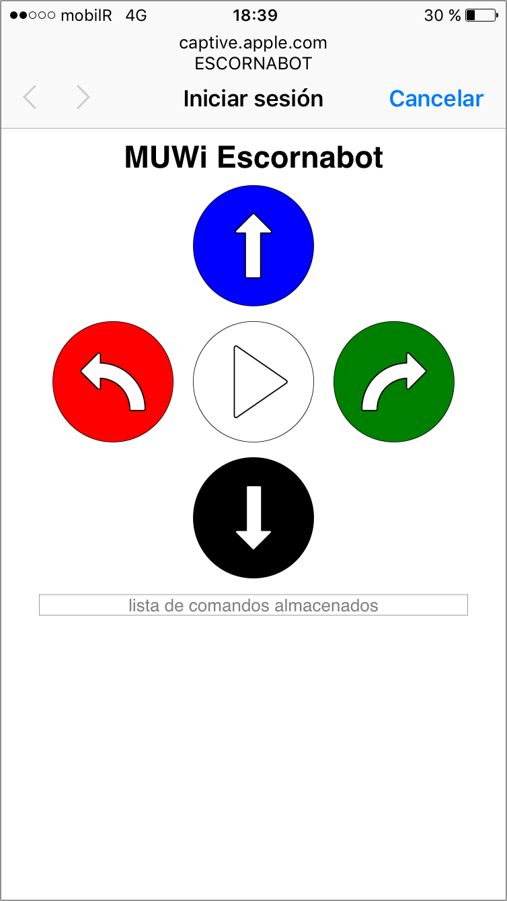
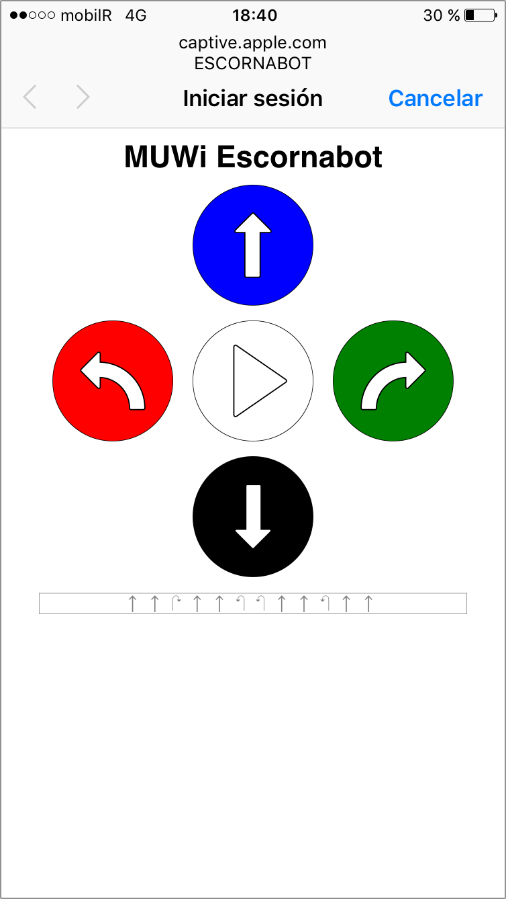

# Mando Universal WiFi para Escornabot

Firmware para el *[módulo ESP-01 de Espressif](https://www.espressif.com/en/products/hardware/esp8266ex/overview)* que añade conectividad WiFi y un mando de control remoto universal para el [Escornabot](https://github.com/escornabot/).

## Descarga

Descarga la **[última versión aquí](https://github.com/mgesteiro/escornabot-muwi/releases/latest)**

## Instalación

Utiliza el IDE de Arduino o cualquier otra herramienta para programar tu ESP-01 con el firmware de la carpeta *MUWi*.

Puedes encontrar un artículo con todos los detalles y explicaciones aquí:

https://mgesteiro.com/articles/muwi/

## Capturas

 

## LICENCIA / LICENSE

Este trabajo esta sujeto a la licencia [GNU General Public v3.0 License](LICENSE-GPLV30). Todos los ficheros multimedia y de datos que no sean código fuente están sujetos a la licencia [Creative Commons Attribution 4.0 BY-SA license](LICENSE-CCBYSA40).

Más información acerca de estas licencias en [licencias Opensource](https://opensource.org/licenses/) y [licencias Creative Commons](https://creativecommons.org/licenses/).

This work is licensed under the [GNU General Public License v3.0](LICENSE-GPLV30). All media and data files that are not source code are licensed under the [Creative Commons Attribution 4.0 BY-SA license](LICENSE-CCBYSA40).

More information about licenses in [Opensource licenses](https://opensource.org/licenses/) and [Creative Commons licenses](https://creativecommons.org/licenses/).
